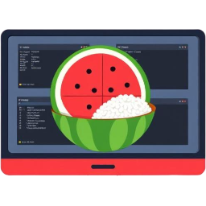

<div align="center">

  # 🍉 Komorice 🍚

  A komorebi GUI ricing configurator!

  [](https://github.com/iced-rs/iced)

  

  

</div>

## Overview

**Komorice** is a user-friendly graphical interface designed to simplify the configuration of the Windows Tiling Window Manager, [**Komorebi**](https://github.com/LGUG2Z/komorebi), and the Windows hotkey daemon, [**whkd**](https://github.com/LGUG2Z/whkd). With Komorice, users can easily customize their tiling window management experience and keyboard bindings, making it simple to create a productive workspace that fits their personal preferences.

## Usage

> [!IMPORTANT]
> Before using komorice, make sure to backup your `komorebi.json` and `whkdrc` files!

Once you have Komorice up and running, it will try to automatically load your existing configuration files.
On the home screen you can choose to edit the currently active configuration files or load existing ones or create new ones from scratch.
When editing a configuration file, you can use the sidebar to navigate between different configuration categories and adjust the settings to your liking. You can always use the "Home" button to get back to the home screen and you can move around between the Komorebi and whkd configurations and edit both at the same time.

**Be sure to save changes to see them reflected in your setup.**


## **Home**
  This is the starting screen. Here you can you can choose to edit either your Komorebi or whkd configuration.
  
  If the home screen shows the "Edit active [...]" (where `[...]` is either `config` or `whkdrc` for Komorebi and whkd configuration files, respectively), that means it loaded your configuration successfully and pressing that button will let you modify your configuration.
  You can also load another existing configuration file or create a new one from scratch.

## Komorebi Configuration
 
- #### **General**:
  Includes all the general and global config options.
  <details>
  <summary>Screenshots:</summary>
  
  
  
  

  </details>
  
- #### **Monitors**:
  It shows a real-time preview of your connected monitors and you can click any monitor to edit it.

  You can also toggle off the `Show Monitors` checkbox to be able to configure or add other monitor configs whitout being tied to the currently loaded monitors.
    - When editing a `Monitor` you are able to configure some configs on a per-monitor basis, like the padding or the work area offset.
    - You are also able to edit the monitor's `Workspaces`. When you press that button you get access to a list of the current workspaces and you can move, add or delete them as you see fit.
    When clicking on a `Workspace` you will enter that workspace config page, where you can change all the options specific to that workspace. You can also enter the `Workspace Rules`
    or `Initial Workspace Rules` to edit the rules for that workspace.
    - You can use the titles on top to navigate back.

  <details>
  <summary>Screenshots:</summary>
  
  
  
  
  
  *These images show how you can have multiple monitor configs, but only use some for the currently loaded monitors. In this case there are 3 monitor configs,
  the main monitor uses config index 0, while the second monitor uses config index 2. You set this up with the `Display Index Preferences`*
    
  **Monitor Screen:**
  

  **Workspaces Screen:**
  

  **Workspace [0] - "I" Screen:**
  

  **Workspace [0] - "I" Screen:** (Example of setting up `Window Container Behaviour Rules`)
  

  **Workspace [1] - "II" - Workspace Rules Screen:**
  

  **Monitor Screen:** (Example of setting up `Wallpaper` for monitor 0)
  

  </details>
  
- #### **Border**:
  Edit all configs related to the borders.
  <details>
    <summary>Screenshots:</summary>

    **Border:** (Edit the border colours with a color picker)
    
    

  </details>
- #### **Stackbar**:
  Edit all configs related to the stackbars. It shows a preview of the resulting stackbars on the bottom of this page.

  <details>
    <summary>Screenshots:</summary>
    
    **Stackbar:** (See a demo of how the stackbar will look like)
    

  </details>
- #### **Transparency**:
  Edit all configs related to the transparency, including the `Transparency Ignore Rules`.
- #### **Animations**:
  Edit all configs related to animations.
  <details>
    <summary>Screenshots:</summary>

    **Animations:** (Edit per type)
    

    **Animations:** (Or globally)
    

  </details>
- #### **Theme**:
  Set or edit the komorebi global theme. Be aware that using this will override your border colors from **Border**.
- #### **Rules**:
  Set or edit all your komorebi application rules.

  You can easily create, edit, copy, paste or remove your rules. When you copy a rule it copies it with the correct JSON
  format to be able to be pasted on a `komorebi.json` file directly. So you can eaasily copy some rule and share it with
  others on Discord. The same way, if you copy a rule from someone else on Discord or on their `komorebi.json` file, komorice
  will recognize that the contents of your clipboard can be serialized to a rule and will show the paste button when you are
  creating a new rule.
  
  <details>
    <summary>Screenshots:</summary>

    **Rules:**
    

    **Rules:** (You can edit, copy or remove existing rules)
    

    **Rules:** (You can easily create new rules)
    

    **Rules:** (Paste button active so that you can paste a rule from your clipboard)
    

  </details>
  
- #### **Live Debug**:
  WIP (It will let you act on your komorebi immediately without changing your config, somewhat like the `komorebi-gui` lets you do now...)
- #### **Settings**:
  Change the komorice app settings.

## Whkd Configuration

Komorice also lets you configuring `whkd` alongside Komorebi, providing a complete window management configuration solution.

- #### **Whkd**:

  Configure your whkd settings, including shell selection and pause binding.
  
  <details>
    <summary>Screenshots:</summary>

  
  

  *You can get some help setting up komorebic commands. You can search through all commands and see their description.*
  
  </details>

- #### **Bindings**:

  Manage your global keyboard bindings that work across all applications.

  *In case WHKD is running, when setting up a keybind, Komorice will stop it so you can actually set up a keybind, otherwise the keys would be captured by WHKD. When you close the key capture modal, Komorice restarts WHKD again.*
    
  <details>
    <summary>Screenshots:</summary>

  **Bindings:**
  

  *The yellow color on a key combination means that key combination is duplicated on multiple bindings.*

  **Add New Binding:**
  

  **Key Capture:**
  
  
  
  </details>

- #### **App Bindings**:

  Set up application-specific keyboard bindings that only trigger when specific applications are focused. The `Process Name` used by the app bindings isn't obvious at all, it uses the file description of the process which is a pain to find. So to make it simpler, *Komorice* has a helper that lets you select from a list of currently running processes and it will get the correct name for you!

  With App Bindings, you can:
  * Create keyboard shortcuts that only work in specific applications (like Firefox or Chrome)
  * Set default behaviors that apply across all applications
  * Ignore specific key combinations in certain applications
  * Easily select running processes to configure bindings for them

  *In case WHKD is running, when setting up a keybind, Komorice will stop it so you can actually set up a keybind, otherwise the keys would be captured by WHKD. When you close the key capture modal, Komorice restarts WHKD again.*

  <br/>
  <details>
    <summary>Screenshots:</summary>

  

  **Expanded App Binding Configuration:**
  
  
  
  **Add New App Binding:**
  

  **Process Selection:**
  

  </details>

## Installation

To get started with Komorice, follow these steps:

1. Install from cargo:
   ```bash
   cargo install --locked --git https://github.com/alex-ds13/komorice.git
   ```
2. Run the application:
   ```bash
   komorice.exe
   ```

## Compatible Versions

| Komorice | Komorebi |  whkd  |
| -------- | -------- | ------ |
| 0.1.0    | 0.1.39   | 0.2.10 |

## License

`komorice` is licensed under the [Komorebi 2.0.0 license](https://github.com/LGUG2Z/komorebi-license), which is a fork of the
[PolyForm Strict 1.0.0 license](https://polyformproject.org/licenses/strict/1.0.0). On a high level this means that you are free
to do whatever you want with `komorice` for personal use other than redistribution, or distribution of new works (i.e. hard-forks)
based on the software.

Anyone is free to make their own fork of `komorice` with changes intended either for personal use or for integration back upstream
via pull requests.

*The [Komorebi 2.0.0 License](./LICENSE.md) does not permit any kind of commercial use.*

### Contribution licensing

Contributions are accepted with the following understanding:

- Contributed content is licensed under the terms of the 0-BSD license
- Contributors accept the terms of the project license at the time of contribution

By making a contribution, you accept both the current project license terms, and that all contributions that you have
made are provided under the terms of the 0-BSD license.

<details>
<summary><h4>0-BSD license</h4></summary>  

  #### Zero-Clause BSD

```
Permission to use, copy, modify, and/or distribute this software for
any purpose with or without fee is hereby granted.

THE SOFTWARE IS PROVIDED “AS IS” AND THE AUTHOR DISCLAIMS ALL
WARRANTIES WITH REGARD TO THIS SOFTWARE INCLUDING ALL IMPLIED WARRANTIES
OF MERCHANTABILITY AND FITNESS. IN NO EVENT SHALL THE AUTHOR BE LIABLE
FOR ANY SPECIAL, DIRECT, INDIRECT, OR CONSEQUENTIAL DAMAGES OR ANY
DAMAGES WHATSOEVER RESULTING FROM LOSS OF USE, DATA OR PROFITS, WHETHER IN
AN ACTION OF CONTRACT, NEGLIGENCE OR OTHER TORTIOUS ACTION, ARISING OUT
OF OR IN CONNECTION WITH THE USE OR PERFORMANCE OF THIS SOFTWARE.
```
</details>

## Support

If you have any issues, questions, or feedback regarding Komorice, feel free to open an issue in the GitHub repository.

## Acknowledgements

Thanks to the Komorebi community and specially to [@LGUG2Z](https://github.com/LGUG2Z) who have made this project possible!
